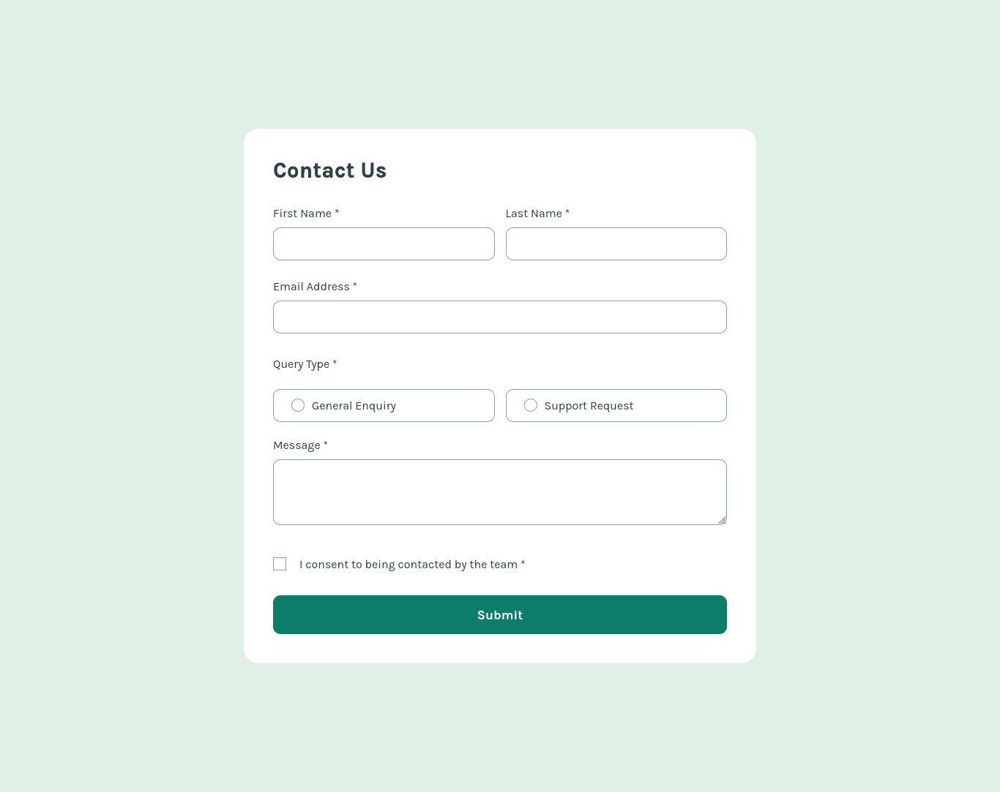

# Frontend Mentor - Contact form

This is a solution to the [Contact form challenge on Frontend Mentor](https://www.frontendmentor.io/challenges/contact-form--G-hYlqKJj).

### Screenshot

### Links

-   Solution URL: [My solution page](https://www.frontendmentor.io/solutions/responsive-contact-form-page-html-css-js-ViEajFmP1c)
-   Live Site URL: [https://iambraga.github.io/contact-form](https://iambraga.github.io/contact-form)/

## My process

### Built with

-   Semantic HTML5 markup
-   CSS properties
-   Javascript
-   Flexbox

## Author

-   Website - [Eduardo Braga](https://github.com/iambraga)
-   Frontend Mentor - [@iambraga](https://www.frontendmentor.io/profile/iambraga)
